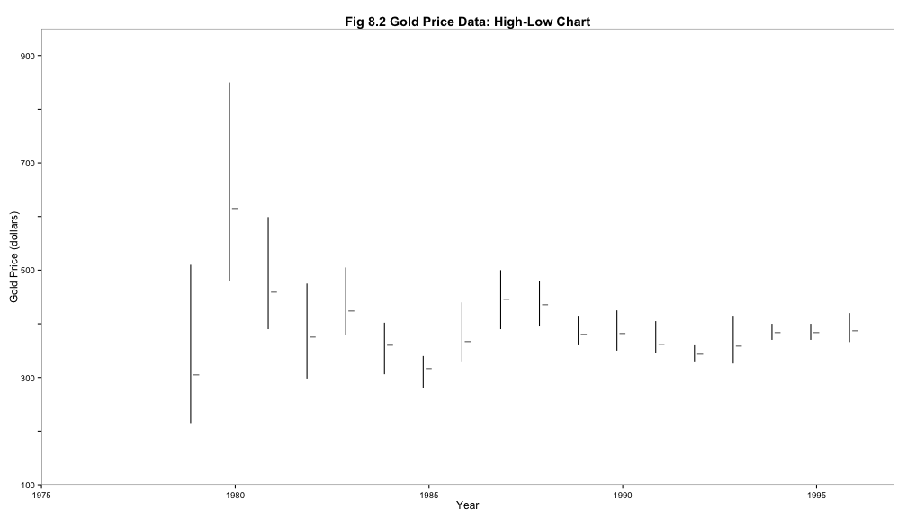

Your Biennial Visual Tech Round-up
========================================================
author: Myfanwy Johnston
incremental: true

Your Survey Responses
========================================================


So here's what we're going to do:
========================================================

 1) Making better/more effective graphs
 
      - Enormous topic
      - I'll show you a few examples of some graphs you may not have seen before
      - You will have access to the literal source code of everything I show you.

 2) **Brief** introduction to Git/GitHub


 3) **Brief** introduction to rmarkdown

 4) An actual workflow, from start to finish


We'll start with the graphs you need to stop making, right now.
========================================================
right: 50%%
incremental: true
<br>
<br>
<br>
 <br>  No more pie charts.
<br>
<br>
(...unless it's this one)

***
<div>  </div>


=======================================================
Pie charts are bad at communicating the basics (scale, order, trends)


Use a bar chart instead, or for trends across time, use a (single) stacked bar chart.

No more grouped bar charts
=======================================================

 

Do This Instead
=====================================================
 


Oo! New graphs!
========================================================
 

Good data visualization in the wild
==================================


[New York Times](http://www.nytimes.com/imagepages/2007/12/10/science/20071211_WHALE_GRAPHIC.html)

[FiveThirtyEight](http://fivethirtyeight.com/datalab/theres-a-gap-between-what-the-public-thinks-and-what-scientists-know/)

ESPN


A Windy road
========================================================
right: 35%


***
There are some seriously good arguments for an R-based workflow.

It's not perfect yet.


GitHub
========================================================
<br>
<br>
**77%** of you said you don't know what GitHub is.

<small> So let's ctrl-click and [go to GitHub](http://www.github.com/) </small>

So GitHub is actually
========================================================
right: 45%
incremental: false

<br>
A user-friendly wrapper* for Git

***


<div align="right"> <small> *and so much more than that </small>

What is Git?
========================================================
* An open source version control project started by Linux creator Linus Torvalds.
* Git manages and stores revisions of projects.
* Mostly used for code, but can be used to manage any other type of file.
    - Like a filing system for every draft of a document.
* If you want to make a change to a project, you copy the whole project repository to your own system,
  make your changes on that local copy, then you "check in" the changes to the central server.
    - Command line
* Okay so what is GitHub again?

GitHub
========================================================
right: 40%

* GitHub is a Git repository hosting service
  - Paraphrasing Jennifer Bryan (UBC), GitHub represents "an end to file salad"
* Git = command line, GitHub = web-based GUI
* Provides access control and several collaboration features.
    - Fork, Pull Request, Merge
    
***
<div></div>


What is R Markdown?
========================================================
incremental: false

<br>
<br>
* Markdown is a simple formatting syntax for authoring HTML, PDF, and MS Word documents.
<br>
* This slideshow is an R Markdown presentation (via .Rpres). 


<br> <br>
<div align="right"> <small> ...and begin Carson Sievert Slides </small></div>

Markdown Basics
========================================================
incremental:false
title:false
right: 55%

Markdown syntax

    Header 1
    ================
    Header 2
    ----------------
    ### Header 3
    
    This is regular text.
    
    > This is a blockquote.
    > 
    > This is the second paragraph in the blockquote.
    >
    > ## This is an H2 in a blockquote

***
Resulting HTML
```
<h1>Header 1</h1>
<h2>Header 2</h2>
<h3>Header 3</h3>

<p>This is regular text.</p>

<blockquote>
<p>This is a blockquote.</p>

<p>This is the second paragraph in the blockquote.</p>

<h2>This is an H2 in a blockquote</h2>
</blockquote>
```
  
Header 1
================
incremental:false

Header 2
----------------
### Header 3

This is regular text.
    
> This is a blockquote.
> 
> This is the second paragraph in the blockquote.
>
> ## This is an H2 in a blockquote


Markdown Basics 2
========================================================
incremental:false
title:false
right: 55%

Markdown syntax

    Here we have an unordered list.
    
    * Item 1
    * Item 2
      * Item 2a
      * Item 2b
      
    Here we have an ordered list
    
    1. Item 1
    2. Item 2
      * Item 2a
      * Item 2b

***
Resulting HTML
```
<p>Here we have an unordered list.</p>
<ul>
<li>Item 1</li>
<li>Item 2
<ul>
<li>Item 2a</li>
<li>Item 2b</li>
</ul></li>
</ul>
<p>Here we have an ordered list</p>
<ol>
<li>Item 1</li>
<li>Item 2
<ul>
<li>Item 2a</li>
<li>Item 2b</li>
</ul></li>
</ol>
```

Result 2
======================
title:false
incremental:false

Here we have an unordered list.
    
* Item 1
* Item 2
  * Item 2a
  * Item 2b
      
Here we have an ordered list
    
1. Item 1
2. Item 2
  * Item 2a
  * Item 2b

Markdown Basics 3
========================================================
incremental:false
title:false
right: 55%

Markdown syntax

    What if we want to *italicize* or **bold**?
    
    * In a list, I may want to _italicize_ or __bold__ this way.
   
    I can also include inline `code` or 
    
    ```
    blocks of code
    ```
    Or even a [link](http://google.com)
    

***
Resulting HTML
```
<p>What if we want to <em>italicize</em> or <strong>bold</strong>?</p>
<ul>
<li>In a list, I may want to <em>italicize</em> or <strong>bold</strong> this way.</li>
</ul>
<p>I can also include inline <code>code</code> or </p>
<pre><code>blocks of code</code></pre>
<p>Or even a <a href="http://google.com">link</a> </p>
```

Result 3
======================
title:false
incremental:false
<br>
What if we want to *italicize* or **bold**?

* In a list, I may want to _italicize_ or __bold__ this way.

I can also include inline `code` or 

```
blocks of code
```

Or even a [link](http://google.com)


Takeaway message: RStudio + R Markdown + GitHub = your friend
========================================================
<div class="columns-3">
<br>
<br>


</div>


Project Workflow:
========================================================
Tag life study (~1/64 of my dissertation)
<small> <br>

1. Create an .rproj on local directory using "Create Git Repository" option.

2. Load data, tidy data, analyze data, and create some figures.

3. Copy and paste r script into several .rmd files (PDF/LaTeX, HTML, Presentation)

4. Create a ShinyApp, if you like

5. Push to GitHub using Git Software or the website itself ("Publish Repository")

6. Clone to desktop again for revising. </small>

===============
this slide is blank on purpose


You promised us interactive visualizations
=============================================
<br>
These can be achieved with:

  - Shiny Apps
  <br>
  - ggvis (similar to ggplot2, but designed with interactive graphs in mind)
  
  - D3

ShinyApps
==================================
Composed of two code files.  
    1: A User interface (ui.r) that defines the 'look' of the app online.

```r
library(shiny)
shinyUI(fluidPage(
  # Application title
  titlePanel("Hello Haleys!"),
  sidebarLayout(
    sidebarPanel(
      sliderInput("x", "Minimum number of girls with that name", min=5, max = 80000, value = 50,
                  step=500, round = TRUE, width = '100%'),
      actionButton("goButton", label = "Nope, hate 'em, try again") ),
    mainPanel(
      tableOutput("y")
    ))
))
```

ShinyApps
===========================
  2.) A server file (server.r) that tells the server how to actually generate the plots.

```r
library(shiny)
library(babynames)
shinyServer(function(input, output) {
  output$y <- renderTable({
    input$goButton
    dist <- isolate(babynames %>%
                      filter(sex=='F', n > input$x) %>%
                      sample_n(., 5) %>%
                      select(year, name, n) %>%
                      arrange(desc(n))
  )
    dist$year <- as.integer(dist$year)
    print(dist)
  }) 
})
```

These two files combine to run a
==========================
  - [Shiny App on the internet](https://myfanwy.shinyapps.io/NameThatHaley/) (or in a markdown file)

========
<div align="center">  </div>


Summing Up
=======================
* When you work in R, work in Rmarkdown
* When you make graphics, go straight to ggplot2.  Do not pass base graphics, do not pass qplot.  Proceed directly to ggplot2.
* GitHub makes sense for data sanity, not just for publishing data on the web.
* For interactive visualization, ShinyApps are one standalone way to go.  Otherwise, ggvis + GitHub Pages is a great option.


=============================================
<div align="center">  </div>


Of course.
================
<br>
This repo on [GitHub](https://github.com/Myfanwy/VisualTechRoundup2015) - all materials, including slides in PDF
<br>
Also has links to more teaching resources on all these things

Hey Thanks!  Especially:
===========================
<br>
Noam Ross / Davis R-Users Group
<br> <br>
Dr. Jennifer Bryan (thanks for the Fields talk inspiration)
<br> <br>
Carson Sievert, whose RMarkdown slides I forked from GitHub (see?  See how useful?)

==============================

<br>

Let's go eat a lot of food.
